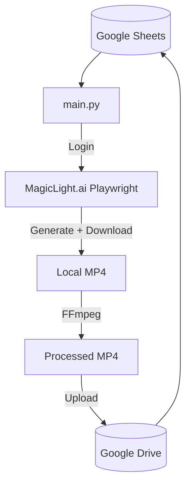

# Architecture Documentation

## Single-Script Architecture

**main.py** (110KB) is the monolithic orchestrator handling all stages sequentially.

## Key Modules

- `accounts.txt`: Multi-account credential pool with auto-rotation.
- `credentials.json`: Google service account for Sheets + Drive.
- `assets/logo.png`: Logo used for FFmpeg overlay.

---

**By OutLawZ™** | https://www.brandex.pk | net2tara@gmail.com
