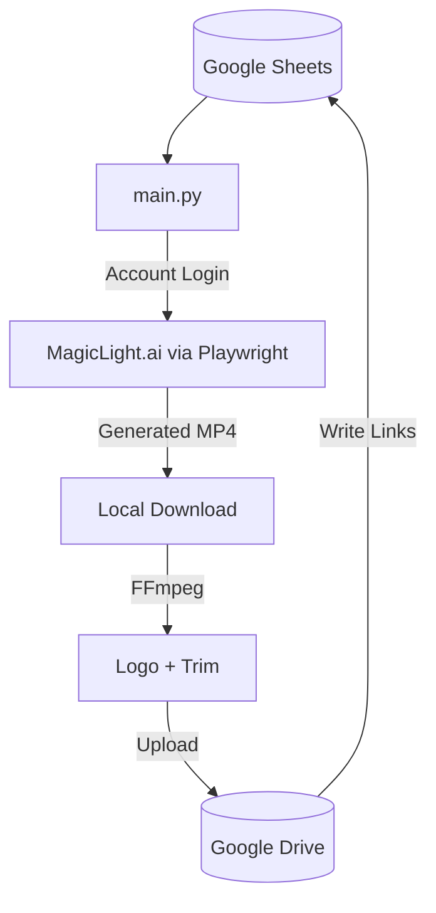

# 🎬 MagicLight Auto v2.1.0

---

# Description

**Magic_Light_V_1** (MagicLight Auto) is the original automated kids story video generation pipeline. It reads pending story prompts from Google Sheets, logs into MagicLight.ai using multi-account rotation, generates video storyboards and clips, downloads the raw output, optionally processes it with FFmpeg (logo overlay, outro trim), uploads to Google Drive, and writes all metadata back to the tracking spreadsheet.

---

# 🚀 Features

- **End-to-End Automation:** Story prompt → MagicLight.ai video → FFmpeg processing → Google Drive upload → Sheet update.
- **Multi-Account Rotation:** Auto-shuffles `accounts.txt` credentials to avoid MagicLight rate limits.
- **Google Sheets Integration:** Full bidirectional sheet operations via service account — reads prompts, writes Drive links, credits, and status.
- **GitHub Actions Support:** Workflow files for remote scheduled execution using repository secrets.
- **FFmpeg Processing:** Logo overlay and outro trimming applied to raw generated clips.
- **Schema Migration:** `--migrate-schema` flag auto-builds all 21 required columns in the linked Sheet.

---

# 🛠️ Tech Stack

| Layer | Technology |
| --- | --- |
| **Language** | Python 3.10+ |
| **Browser Automation** | Playwright (Chromium) |
| **Video Processing** | FFmpeg |
| **Sheets Integration** | `gspread`, `google-auth` |
| **Drive Upload** | Google Drive API |

---

# 📂 Project Structure

```text
Magic_Light_V_1/
├── main.py              # Full pipeline orchestration
├── accounts.txt         # MagicLight.ai login accounts (gitignored)
├── credentials.json     # Google service account key (gitignored)
├── assets/              # Logo and overlay images
├── output/              # Downloaded raw videos
├── docs/                # Extended documentation (SHEET_STRUCTURE.md, etc.)
├── .env                 # Environment config (gitignored)
└── README.md            # Documentation
```

---

# 🏗️ Architecture Diagram



---

# 🏎️ Quick Start

```bash
pip install -r requirements.txt
playwright install chromium
cp .env.example .env   # Fill in SHEET_ID and credentials paths
python main.py
```

---

# ⚙️ Configuration

Set in `.env`:
- `SHEET_ID` — Target Google Spreadsheet ID.
- `DRIVE_FOLDER_ID` — Target Google Drive upload folder.
- `ACCOUNTS_FILE` — Path to `accounts.txt`.
- `CREDENTIALS_FILE` — Path to Google service account JSON.

---

# 🔒 Security Notes

- `accounts.txt`, `credentials.json`, and `.env` are in `.gitignore`.
- Use GitHub Secrets for CI/CD: `ENV_FILE`, `ACCOUNTS_TXT`, `GCP_CREDENTIALS`.

---

# 📝 License

MIT License

---

## 👨‍💻 Credits

**By OutLawZ™**

Website: https://www.brandex.pk | net2tara@gmail.com
